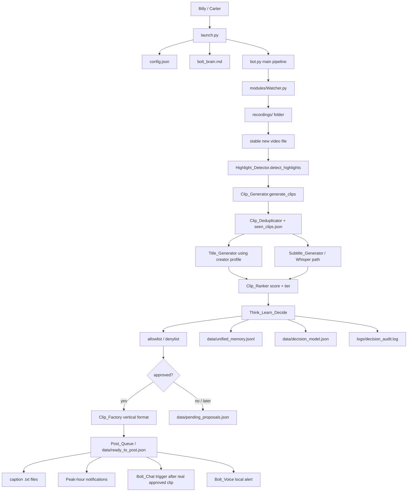
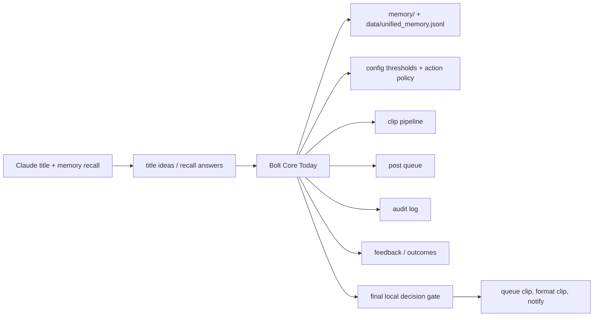
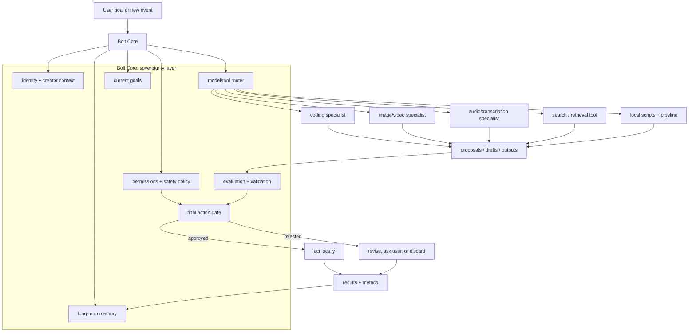
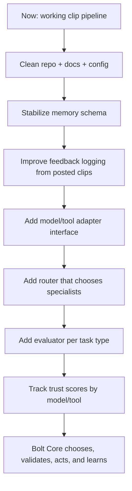

# Bolt Process Roadmap

This is the living visual map for Bolt: what exists today, how the pieces connect,
and where the "Bolt has sovereignty, outside models provide counsel" architecture
fits later.

## Current Bolt Runtime

## What Bolt Owns Today

Bolt already owns the local action gate. The outside model path is currently used
for narrow help, mainly titles and memory recall. `Think_Learn_Decide` is local
and does not hand execution control to a cloud model.

## Desired Future Architecture

In this future version, outside models never become Bolt's controller. They are
specialists that return proposals. Bolt keeps the memory, policies, taste,
trust scores, action permissions, and final say.

## Roadmap From Here

## Where We Are

| Layer | Status | Notes |
|---|---|---|
| Recording intake | Working | `Watcher.py` persists processed filenames. |
| Clip pipeline | Working | Detect, clip, dedup, title, subtitle, rank, format, queue. |
| Local decision gate | Started | `Think_Learn_Decide.py` proposes, checks policy, confirms, audits. |
| Memory | Started | Markdown memory exists; unified event memory exists. Retrieval needs more polish. |
| Feedback learning | Started | Decision model tracks feedback and outcomes; performance logging exists. |
| Outside model counsel | Partial | Claude is used for titles and memory recall, not full control. |
| Specialist router | Not built yet | Future layer for Claude/Grok/OpenAI/local tools/etc. |
| Evaluators | Not built yet | Future layer for tests, score checks, source checks, user taste checks. |
| Trust scores | Not built yet | Future model/tool performance memory. |

## Design Principle

Bolt should not be a wrapper around another model's brain.

Bolt should be the system that remembers, routes, judges, validates, acts, and
learns. Outside models are counsel. Bolt keeps sovereignty.
